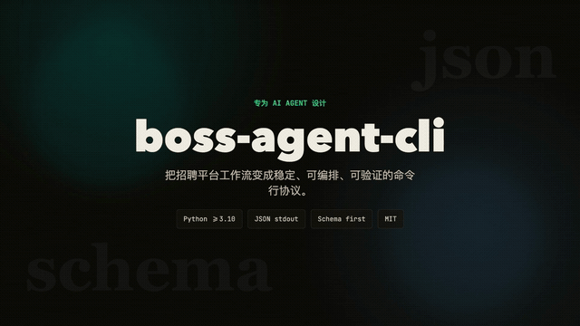

<div align="center">

# boss-agent-cli

*🤖 专为 AI Agent 设计的 BOSS 直聘本地辅助 CLI —— 搜索 · 福利筛选 · 候选池 · JSON 信封，默认低风险合规。*

[](https://github.com/can4hou6joeng4/boss-agent-cli/actions/workflows/ci.yml)
[](https://codecov.io/gh/can4hou6joeng4/boss-agent-cli)
[](https://python.org)
[](LICENSE)
[](https://github.com/can4hou6joeng4/boss-agent-cli/releases)
[](https://pypi.org/project/boss-agent-cli/)
[](https://github.com/can4hou6joeng4/boss-agent-cli/pulls)

[快速上手](docs/getting-started.md) · [Agent 集成](#-agent-集成) · [命令](#-命令) · [排障](docs/troubleshooting.md) · [路线图](ROADMAP.md) · **中文** | [English](README.en.md)

<a href="demo/showcase/boss-agent-cli-showcase.mp4" title="观看完整项目展示视频">
  
</a>

**[观看完整展示视频](demo/showcase/boss-agent-cli-showcase.mp4)** · [终端交互演示](demo/demo-zh.gif) · schema 驱动 · 福利筛选 · JSON 信封

</div>

<p align="center">
  <a href="https://www.atlascloud.ai/?utm_source=github&utm_medium=link&utm_campaign=boss-agent-cli">
    
  </a>
</p>

> 🎁 **[Atlas Cloud](https://www.atlascloud.ai/?utm_source=github&utm_medium=link&utm_campaign=boss-agent-cli)** 为 `boss ai` 提供了一个全模态、OpenAI 兼容的推理入口 —— 一个 key 即可访问 DeepSeek、Qwen、GLM、Kimi、MiniMax、Claude、GPT 等模型，无需逐家接入。在 `boss ai config` 里选用 `--provider atlas`（`base_url=https://api.atlascloud.ai/v1`、默认模型 `deepseek-ai/deepseek-v4-pro`）即可，配置详见 [AI 模型接入](docs/integrations/ai-models.md#atlas-cloud一个-key-覆盖多家模型)；预算友好的 [coding plan](https://www.atlascloud.ai/console/coding-plan)。

> [!TIP]
> 
>
> **Doloffer Guide** 致力于让优质 AI 工具的获取更简单。平台主打 GPT 与 Claude 等主流 AI 服务的正版会员充值，提供一站式订阅管理，主打安全稳定与无忧售后。
>
> 💡 **极速订阅**： [专属链接](https://doloffer.com/friend/BEv3yvKS)（输入优惠码 `AI8888` 享 9 折特惠）

## ⚠️ 合规边界

默认启用**低风险辅助模式**：本地辅助 · 只读优先 · 用户主动触发 · 不规避风控 · 不批量触达 · 不抓取数据。打招呼（greet / batch-greet）、投递、联系方式交换、招聘者候选人搜索 / 简历 / 聊天、消息回复等敏感能力默认阻断并返回 `COMPLIANCE_BLOCKED`；需要时请回到 BOSS 直聘平台官网由用户手动完成。

## ✨ 核心能力

- **职位发现**：关键词搜索 + 8 维筛选，按编号回看缓存结果 —— `search` `show` `detail`
- **福利筛选（核心差异化）**：`--welfare "双休,五险一金"` 自动翻页补抓、按 AND 逻辑做**真实匹配**，并可 `--sort score` 按本地匹配分排序 —— `search --welfare`
- **本地候选池与统计**：查看详情后本地保存 / 用标签和备注复盘候选岗位、离线对比、查看漏斗统计；投递与沟通回到官网手动完成 —— `shortlist` `stats` `watch` `preset`
- **AI 求职增强**：JD 分析、简历润色、定向优化、候选池匹配、模拟面试、沟通指导 —— `ai analyze-jd` `ai polish` `ai optimize` `ai fit` `ai interview-prep` `ai chat-coach`
- **Schema 驱动 + JSON 信封**：stdout 只输出 `{ok, data, pagination, error, hints}` 信封，`boss schema` 是能力真源，适合 CLI 编排 / Shell Agent / MCP / Python SDK
- **招聘者最小闭环**：职位列表与上下架（`hr jobs list/online/offline`）；候选人个人数据链路默认阻断
- **多平台抽象**：`Platform` / `RecruiterPlatform` 双注册表，`--platform zhipin|zhilian|qiancheng`

## 🚀 快速开始

```bash
# 安装（uv 推荐；浏览器内核仅用于用户主动登录 / 本地导出）
uv tool install boss-agent-cli
patchright install chromium

# 跑通低风险闭环
boss doctor                                                   # 环境自检
boss login                                                    # 用户主动登录（按平台选择链路）
boss status                                                   # 验证登录态
boss search "Golang" --city 广州 --welfare "双休,五险一金"     # 搜索 + 福利筛选
boss detail <security_id>                                     # 查看详情
boss shortlist add <security_id> <job_id> --tags 后端,远程    # 加入本地候选池并打本地标签
boss shortlist compare --tag 远程                             # 离线对比候选岗位
boss stats                                                    # 本地统计

# 招聘者模式（候选人数据链路默认阻断）
boss hr jobs list
```

所有命令输出结构化 JSON（`ok` 判断成败，`exit 0/1`）。完整上手见 [快速上手](docs/getting-started.md)。

## 🎭 角色与多平台

| 平台 | 求职者 | 招聘者 | 状态 |
|------|:--:|:--:|------|
| BOSS 直聘 (`zhipin`) | ✅ | ✅ | 默认 |
| 智联招聘 (`zhilian`) | ✅ 候选者侧只读 + 本地辅助对等 | — | 招聘者侧未接入，运行时直接拒绝 `hr` 子命令 |
| 前程无忧 / 51job (`qiancheng`) | 🚧 已注册占位 | — | 统一返回 `NOT_SUPPORTED`，待只读研究门槛满足后再接入 |

```bash
boss --platform zhilian search "Python"   # 指定平台（也支持 --platform zhipin|zhilian|qiancheng）
boss config set platform zhilian          # 设为默认
```

`boss hr ...` 当前仅支持默认招聘者平台 `zhipin-recruiter`。设计细节见 [docs/platform-abstraction.md](docs/platform-abstraction.md)。

## 🤖 Agent 集成

推荐先读：[Agent Quickstart](docs/agent-quickstart.md) · [Capability Matrix](docs/capability-matrix.md) · [Host Examples](docs/agent-hosts.md)

```json
// 方式一：MCP（推荐）—— Claude Desktop / Cursor 等 MCP 宿主，暴露 35 个默认低风险只读工具
{ "mcpServers": { "boss-agent": { "command": "uvx", "args": ["--from", "boss-agent-cli[mcp]", "boss-mcp"] } } }
```

```bash
# 方式二：subprocess —— 先让 Agent 读能力自描述，再解析 stdout JSON
boss schema
```

```python
# 方式三：Python 直接嵌入（随 py.typed 发布，可作类型化库）
from boss_agent_cli import AuthManager, BossClient, AuthRequired
with BossClient(AuthManager(...)) as client:
    result = client.search_jobs("Golang", city="广州")
```

## 📚 命令

`boss schema` 暴露 35 个顶层命令 + 9 个一级招聘者子命令，按工作流分组：

- **认证**：`login` · `logout` · `status` · `doctor`
- **职位发现**：`search` · `detail` · `show` · `cities` · `history`
- **本地整理**：`watch` · `preset` · `shortlist` · `stats`
- **简历 / AI**：`resume` · `me` · `ai analyze-jd` · `ai polish` · `ai optimize` · `ai fit` · `ai interview-prep` · `ai chat-coach`
- **系统**：`schema` · `platforms` · `export` · `config` · `clean`
- **招聘者**：`hr jobs list/online/offline`
- **受限动作（默认低风险模式阻断）**：`greet` · `batch-greet` · `apply` · `exchange` · `chat*` · `pipeline` · `digest`

完整命令表、参数与福利筛选原理见 **[命令参考](docs/commands.md)**；能力真源是 `boss schema`（支持 `--format openai-tools` / `anthropic-tools` 导出工具定义）。

## 🩺 诊断与排障

```bash
boss doctor             # 环境自检
boss status --live      # 可选：一次低频只读探测
boss doctor --live-probe
```

错误信封统一携带 `code` + `recoverable` + `recovery_action`，可程序化恢复。Browser Bridge 本地诊断覆盖 `bridge_daemon` / `bridge_extension` / `bridge_protocol` / `bridge_workspace` / `bridge_exec` / `bridge_fetch` / `bridge_navigate` 七项，daemon 用 `python -m boss_agent_cli.bridge.daemon --serve` 启动。Bridge 只用于本地诊断、用户主动登录兼容和只读辅助，命中平台风控时停止自动化访问，不切换通道重试。

完整检查项、CDP 启动示例与错误码见 **[诊断与排障](docs/troubleshooting.md)**；涉及 Cookie / CDP / patchright / 请求频率 / 接口漂移的问题先读 [平台风险边界](docs/platform-risk.md)。

## ⚙️ 配置

```bash
boss config list                    # 查看所有配置
boss config set default_city 广州   # 设置默认城市
boss config reset                   # 恢复默认
```

配置位于 `~/.boss-agent/config.json`：默认城市 / 薪资、请求间隔、日志级别、登录超时、CDP 地址、导出目录。

## 🏗️ 技术架构

```
CLI (Click)
  └─ 合规护栏（默认低风险模式，阻断敏感写操作与候选人个人信息链路）
       └─ AuthManager ── 用户主动登录态（Fernet + PBKDF2 机器绑定加密）
       └─ Platform 双注册表 ── BossPlatform / ZhilianPlatform / QianchengPlatform
       └─ BossClient ── httpx + 节流（高斯延迟）；兼容 CDP / Bridge / patchright 登录与导出
       └─ CacheStore（SQLite WAL） · AIService（OpenAI / Anthropic）
            └─ output.py → JSON 信封 → stdout
```

`QianchengPlatform (51job 占位适配器，统一返回 NOT_SUPPORTED)`：仅用于平台注册与 schema 可见性，接真实接口前需满足只读研究门槛。

**不变量**：stdout 仅 JSON 信封 · stderr 仅日志 · `exit 0/1` · 错误含 `code/recoverable/recovery_action` · `boss schema` 为能力真源。
**选型**：Python ≥ 3.10 · Click · httpx · patchright / CDP / Bridge（仅登录与导出，**不得规避风控**）· cryptography（Fernet）· sqlite3（WAL）· pytest（1400+ 项）。

## 🔌 本地存储

所有状态在 `~/.boss-agent/`：加密登录态、搜索缓存、候选池、本地简历与 AI 配置。除显式发起的 API 调用外，数据不离开本机。

## 🤝 贡献 & 致谢

欢迎 Issue / PR：`git clone` → `feat/xxx` 分支 → 写测试 → `python scripts/quality_baseline.py`（ruff + 离线 pytest + mypy）→ PR。详见 [CONTRIBUTING.md](CONTRIBUTING.md)，上手路径见 [快速上手](docs/getting-started.md)。

致谢 [geekgeekrun](https://github.com/geekgeekrun/geekgeekrun) · [boss-cli](https://github.com/jackwener/boss-cli) · [opencli](https://github.com/jackwener/opencli)。

## ⚠️ 免责声明

本项目仅用于学习交流和本地辅助，使用时请遵守相关法律法规、BOSS 直聘平台用户协议和隐私政策。默认低风险模式会阻断自动触达、批量操作、规避风控和候选人个人信息处理链路；任何投递、沟通、联系方式交换、招聘者候选人处理都应回到平台官网由用户手动完成。因不当使用产生的一切后果由使用者自行承担，与本项目作者无关。

## 📑 许可证 & 友情链接

[MIT](LICENSE) © [can4hou6joeng4](https://github.com/can4hou6joeng4) · 友链 [LINUX DO](https://linux.do/)
